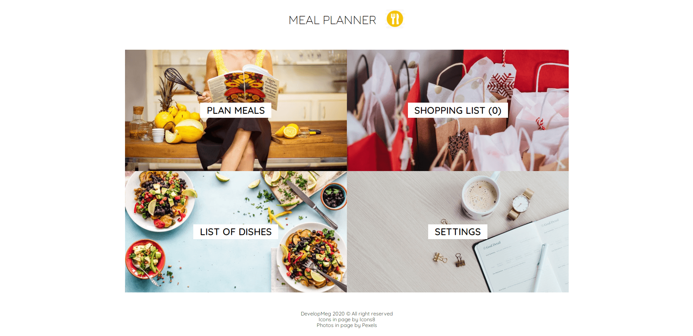
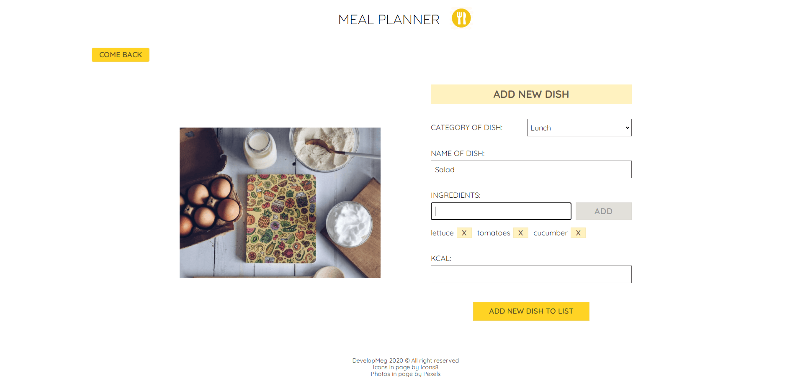
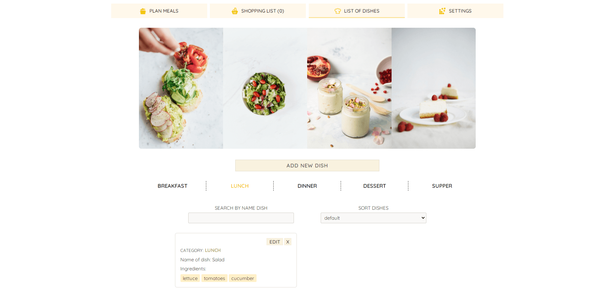
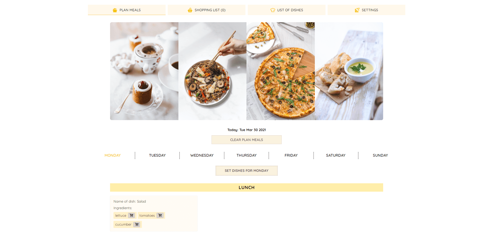
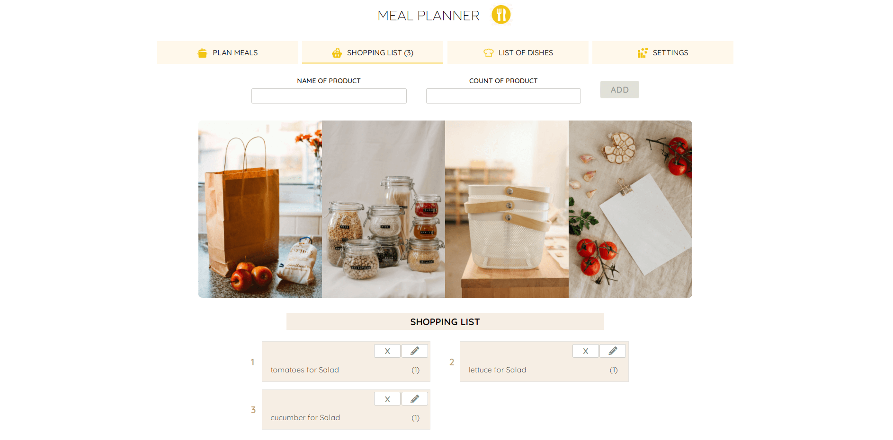

# meal-planner

> This is my old project (which doesn`t contain aspects I learned from feedback), but shows progress of my skills

#### This is an application, which let you plan meals for the whole week and add them to list of dishes

Link: https://developmeg.github.io/meal-planner/

---

## Technologies

- React (Create React App)
- React Router
- Local Storage
- SCSS
- BEM

#### Extra Packages

- react-confirm-alert

## Installation

Clone this repository and install dependencies: `npm install`

Next run application on your localhost: `npm start`

To build project : `npm run build`
